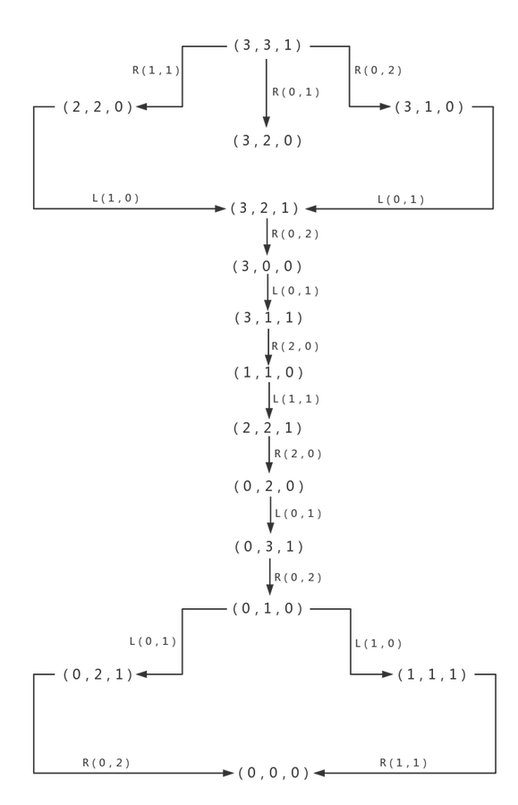

## CP468 Assignment 1 Missionaries and Cannibals
### by Group 4 ZZ-TW-ML-YC
<script type="text/x-mathjax-config">
MathJax.Hub.Config({
  tex2jax: {inlineMath: [['$','$'], ['$','$']]}
});
</script>
<script type="text/javascript" src="http://cdn.mathjax.org/mathjax/latest/MathJax.js?config=default"></script>

#### Abstraction

For convenience, in the remainder, each abbreviation has its own meaning: 

|Abbreviation|Meaning|
|-|-|
|$\mathbf{M}$|missionary|
|$\mathbf{C}$|cannibal|
|$N$|number of $\mathbf{M}$ or $\mathbf{C}$ (the same)|
|$B$|number of seats in boat|
|$ml$|number of $\mathbf{M}$ on left side|
|$mb$|number of $\mathbf{M}$ in boat|
|$mr$|number of $\mathbf{M}$ on right side|
|$cl$|number of $\mathbf{C}$ on left side|
|$cb$|number of $\mathbf{C}$ in boat|
|$cr$|number of $\mathbf{C}$ on right side|
|$pos$|position of boat, left side: 1, right side: 0|
|$(ml,cl,pos)$|one state when the boat is empty and on side pos, $ml \mathbf{M}$ and $cl \mathbf{C}$ are on the left side|
|$L(mb,cb)$|carry $mb \mathbf{M}$ and $cb \mathbf{C}$ to left side|
|$R(mb,cb)$|carry $mb \mathbf{M}$ and $cb \mathbf{C}$ to right side| 

<br/>
####Reality Constraints
Each number must be non-negative and less than the total number: $$0<=ml,mb,mr,cl,cb,cr<=N$$ $$0<=mb,cb<=B$$ $$ml+mb+mr==cl+cb+cr==N$$
The boat can not across the river without someone in it: $$0<mb+cb<=B$$

<br/>
####Security Constraints
Whether on left, right or in boat, the number of $\mathbf{M}$ should not less than that of $\mathbf{C}$: 
<br/> 
$$ml==0||ml>=cl$$ $$mb==0||mb>=cb$$ $$mr==0||mr>=cr$$

#### Initial State
$N \mathbf{M}$ and $N \mathbf{C}$ are on one side, let's say left side, with a boat at the same side, described as $(N,N,1)$.

#### Goal State
$N \mathbf{M}$, $N \mathbf{C}$ and the boat are on the right side, described as $(0,0,0)$.  

#### State Space
Take $N==3$, $B==2$ as an example, below is the complete state space graph:


<br/>
There are 15 states, 10 actions and 16*2=32 transition models in total. For short we just show half of these transition models:

|Transition Models|
|-|
$Result\bigl((3,3,1),R(1,1)\bigr)=(2,2,0)$  
$Result\bigl((3,3,1),R(0,1)\bigr)=(3,2,0)$  
$Result\bigl((3,3,1),R(0,2)\bigr)=(3,1,0)$  
$Result\bigl((2,2,0),L(1,0)\bigr)=(3,2,1)$  
$Result\bigl((3,1,0),L(0,1)\bigr)=(3,2,1)$  
$Result\bigl((3,2,1),R(0,2)\bigr)=(3,0,0)$  
$Result\bigl((3,0,0),L(0,1)\bigr)=(3,1,1)$  
$Result\bigl((3,1,1),R(2,0)\bigr)=(1,1,0)$  
$Result\bigl((1,1,0),L(1,1)\bigr)=(2,2,1)$  
$Result\bigl((2,2,1),R(2,0)\bigr)=(0,2,0)$  
$Result\bigl((0,2,0),L(0,1)\bigr)=(0,3,1)$  
$Result\bigl((0,3,1),R(0,2)\bigr)=(0,1,0)$  
$Result\bigl((0,1,0),L(0,1)\bigr)=(0,2,1)$  
$Result\bigl((0,1,0),L(1,0)\bigr)=(1,1,1)$  
$Result\bigl((0,2,1),R(0,2)\bigr)=(0,0,0)$  
$Result\bigl((1,1,1),R(1,1)\bigr)=(0,0,0)$  

#### Path Cost
Path cost increased by one each time when the boat cross the river.

#### Algorithm Analysis
We considered two algorithms for this problem:  
iterative deepening depth-first search(IDS) and iterative deepening a\* search(IDA\*).  

||IDS|IDA\*|
|-|-|-|
|Complete|Y|Y|
|Optimal|Y|Y|
|Time|$O(b^d)$|$O(b^d)$|
|Space|$O(bd)$|$O(bd)$|

IDS and IDA\* are both complete in that they will continue searching until find a solution or exhaust all states. They are optimal in that the cost is increasing during iteration, in other words, the first solution found must cost least.  
IDS and IDA\* are also the same in structure: outside is a iteration of limit and inside is a recursion of search function.  
But IDS uses $g(n)$ (cost from start state to current state $n$) as limit, IDA\* uses $f(n)=g(n)+h(n)$ (global estimated cost) instead.  
Moreover, IDS does DFS within the limit from one child state; while IDA\* will expand at the child state with the minimum value of $f(n)$.   

#### Heuristic for IDA*
Suppose a relaxed situation without the security constraint: $\mathbf{M}$ and $\mathbf{C}$ can stay together with any combinations.  
In order to cost least, we fill the boat with at most $B$ people every time from left to right but only let one man come back to pick up remaining people.  
Follow this way, in the last time we send $B$ people to right, while in other rounds(turn right then come back to left) we can send at most $B-1$ people each time across the river.  
In states when the boat is on the left, $(ml,cl,1)$, it costs at least: $$2*\left\lceil ml+cl-B \over B-1 \right\rceil +1$$

In states when the boat is on the right, $(ml,cl,0)$, since just one person can come to the left, we can transform state from $(ml,cl,0)$ to $(ml+1,cl,1)$ or $(ml,cl+1,1)$ with one step, thus it costs at least: $$2*\left\lceil ml+cl+1-B \over B-1 \right\rceil +2$$

Since the two polynomials together describe an optimal cost of the relaxed problem, they are consistent heuristic for the origin $\mathbf{M}$ and $\mathbf{C}$ problem.

#### Outputs
Below is the output of two algorithms when $N==3$ and $B==2$. Solutions of two algorithms are the same because they traverse all actions in the same sequence provided by Action.java. One difference is that IDA\*'s limit starts directly from 9, owing its efficiency to the heuristic function.
```
IDS N=3 B=2
try depth limit 1
try depth limit 2
try depth limit 3
try depth limit 4
try depth limit 5
try depth limit 6
try depth limit 7
try depth limit 8
try depth limit 9
try depth limit 10
try depth limit 11
optimal solution found
step 1: (3,3,1) => (0,2)
step 2: (3,1,0) <= (0,1)
step 3: (3,2,1) => (0,2)
step 4: (3,0,0) <= (0,1)
step 5: (3,1,1) => (2,0)
step 6: (1,1,0) <= (1,1)
step 7: (2,2,1) => (2,0)
step 8: (0,2,0) <= (0,1)
step 9: (0,3,1) => (0,2)
step 10: (0,1,0) <= (0,1)
step 11: (0,2,1) => (0,2)

IDA* N=3 B=2
try depth limit 9
try depth limit 11
optimal solution found
step 1: (3,3,1) => (0,2)
step 2: (3,1,0) <= (0,1)
step 3: (3,2,1) => (0,2)
step 4: (3,0,0) <= (0,1)
step 5: (3,1,1) => (2,0)
step 6: (1,1,0) <= (1,1)
step 7: (2,2,1) => (2,0)
step 8: (0,2,0) <= (0,1)
step 9: (0,3,1) => (0,2)
step 10: (0,1,0) <= (0,1)
step 11: (0,2,1) => (0,2)
```

Both algorithms are able to solve $N$ missionaries, $N$ cannibals and $B$ seats problems. Below are optimal costs when $N<=10$ and $B<=10$:

|$\mathbf{B}\\ \mathbf{N}$|$\mathbf{1}$|$\mathbf{2}$|$\mathbf{3}$|$\mathbf{4}$|$\mathbf{5}$|$\mathbf{6}$|$\mathbf{7}$|$\mathbf{8}$|$\mathbf{9}$|$\mathbf{10}$|
|-----|---|---|----|---|----|----|----|----|----|----|
|$\mathbf{1}$| N | N | N  | N | N  | N  | N  | N  | N  | N  |
|$\mathbf{2}$| 1 | 5 | 11 | N | N  | N  | N  | N  | N  | N  |
|$\mathbf{3}$| 1 | 3 | 5  | 9 | 11 | 13 | N  | N  | N  | N  |
|$\mathbf{4}$| 1 | 1 | 3  | 5 | 7  | 9  | 11 | 13 | 15 | 17 |
|$\mathbf{5}$| 1 | 1 | 3  | 3 | 5  | 7  | 7  | 9  | 9  | 11 |
|$\mathbf{6}$| 1 | 1 | 1  | 3 | 3  | 5  | 5  | 7  | 7  | 9  |
|$\mathbf{7}$| 1 | 1 | 1  | 3 | 3  | 3  | 5  | 5  | 7  | 7  |
|$\mathbf{8}$| 1 | 1 | 1  | 1 | 3  | 3  | 3  | 5  | 5  | 5  |
|$\mathbf{9}$| 1 | 1 | 1  | 1 | 3  | 3  | 3  | 3  | 5  | 5  |
|$\mathbf{10}$| 1 | 1 | 1  | 1 | 1  | 3  | 3  | 3  | 3  | 5  |

#### Source Codes
Source codes can be find here: https://github.com/BIOTONIC/MissionariesAndCannibals

|Test.java|State.java|Action.java|IDS.java|IDAStar.java|
|-|-|-|-|-|
|call two algorithms|store state's info & provide functions related to state|use two lists to store all valid arrangements of $\mathbf{M}$ and $\mathbf{C}$ on boat|IDS algorithm|IDA* algorithm|

```
// Test.java
// call two algorithms

public class Test {
    public static void main(String[] args) {
        new IDS(3, 2);
        new IDAStar(3,2);
    }
}
```


```
// State.java 
// store state's info & provide functions related to state

class State {
    int N; // numbers of missionaries or cannibals
    int B; // number of seats on boat
    int ml; // numbers of missionaries on the left
    int cl; // numbers of cannibals on the left
    int pos; // current position of the boat, 0: on the right, 1: on the left

    // start state: ml=N, cl=N, pos=1
    // goal state: ml=0, cl=0, pos=0

    State(int N, int B) {
        this.N = N;
        this.B = B;
        this.ml = N;
        this.cl = N;
        this.pos = 1;
    }

    State(int N, int B, int ml, int cl, int pos) {
        this.N = N;
        this.B = B;
        this.ml = ml;
        this.cl = cl;
        this.pos = pos;
    }

    State doAction(int mb, int cb) {
        if (pos == 0) {
            // current at right, to left
            //
            // 0<=ml+mb<=N
            // && 0<=cl+cb<=N
            // && (ml+mb==0||ml+mb==N||ml+mb==cl+cb)
            if (ml + mb >= 0 && ml + mb <= N
                    && cl + cb >= 0 && cl + cb <= N
                    && (ml + mb == 0 || ml + mb == N || ml + mb == cl + cb)) {
                return new State(N, B, ml + mb, cl + cb, 1);
            } else {
                return null;
            }
        } else {
            // current at left, to right
            //
            // 0<=ml-mb<=N
            // && 0<=cl-cb<=N
            // && (ml==mb||ml+mb==N||ml-mb==cl-cb)
            if (ml - mb >= 0 && ml - mb <= N
                    && cl - cb >= 0 && cl - cb <= N
                    && (ml == mb || ml + mb == N || ml - mb == cl - cb)) {
                return new State(N, B, ml - mb, cl - cb, 0);
            } else {
                return null;
            }
        }
    }

    @Override
    public boolean equals(Object other) {
        if (this == other) {
            return true;
        }
        if (other == null) {
            return false;
        }
        if (getClass() != other.getClass()) {
            return false;
        }
        State otherState = (State) other;
        if (otherState.N == this.N && otherState.B == this.B && otherState.ml == this.ml
                && otherState.cl == this.cl && otherState.pos == this.pos) {
            return true;
        } else {
            return false;
        }
    }

    @Override
    public String toString() {
        return "(" + this.ml + "," + this.cl + "," + this.pos + ")";
    }

    public String toPath(int mb, int cb) {
        return toString() + " " + (pos == 1 ? "=> " : "<= ") + "(" + mb + "," + cb + ")";
    }

    public String toPath(State child) {
        return toString() + " " + (pos == 1 ? "=> " : "<= ") + "("
                + Math.abs(child.ml - ml) + "," + Math.abs(child.cl - cl) + ")";
    }

    boolean isGoal() {
        if (ml == 0 && cl == 0 && pos == 0) {
            return true;
        } else {
            return false;
        }
    }

    int getHeuristic() {
        if (pos == 1) {
            return 1 + 2 * (int) Math.ceil((double) (ml + cl - B) / (B - 1));
        } else {
            return 2 + 2 * (int) Math.ceil((double) (ml + cl + 1 - B) / (B - 1));
        }
    }
}
```

```
// Action.java
// use two lists to store all valid arrangements of m and c on boat

import java.util.ArrayList;

public class Action {
    public static ArrayList<Integer> mbs; // list of numbers of missionaries on boat
    public static ArrayList<Integer> cbs; // list of numbers of cannibals on boat

    Action(int N, int B) {
        mbs = new ArrayList<>();
        cbs = new ArrayList<>();
        for (int b = B; b > 0; b--) {
            for (int mb = 0; mb <= N; mb++) {
                if (mb <= b && b - mb >= 0 && b - mb <= N && (mb == 0 || 2 * mb >= b)) {
                    mbs.add(mb);
                    cbs.add(b - mb);
                }
            }
        }
    }
}
```

```
// IDS.java

import java.util.ArrayList;
import java.util.Stack;

public class IDS {
    int N; // numbers of missionaries and cannibals are both N
    int B; // number of seats on boat

    Action action;
    ArrayList<State> explored;
    Stack<String> records; // records of every optimal step

    static final int SUCCESS = 0;
    static final int FAILURE = -1;
    static final int CUTOFF = -2;

    public IDS(int N, int B) {
        System.out.println("\nIDS N=" + N + " B=" + B);

        this.N = N;
        this.B = B;

        action = new Action(N, B);
        int limit = 0;
        int result;
        State state;
        while (true) {
            // iterate limit
            limit++;
            System.out.println("try depth limit " + limit);
            // init state and explored list before every iteration
            state = new State(N, B);
            explored = new ArrayList<>();
            records = new Stack<>();
            result = search(state, limit);
            if (result == SUCCESS || result == FAILURE) {
                break;
            }
        }

        // print result
        if (result == SUCCESS) {
            int i = 1;
            while (!records.empty()) {
                System.out.println("step " + i + ": " + records.pop());
                i++;
            }
        } else {
            System.out.println("no solution");
        }
    }

    int search(State state, int limit) {
        explored.add(state);
        if (state.isGoal()) {
            explored.remove(state);
            System.out.println("optimal solution found");
            return SUCCESS;
        }
        if (limit == 0) {
            explored.remove(state);
            //System.out.println("cut off");
            return CUTOFF;
        }

        boolean isCutoff = false;
        // traversal all actions
        for (int i = 0; i < action.mbs.size(); i++) {
            State child = state.doAction(action.mbs.get(i), action.cbs.get(i));
            // graph search
            // only expand valid and non-repetitive states
            if (child != null && !explored.contains(child)) {
                //System.out.println(child);
                // recursion, decreasing limit
                int result = search(child, limit - 1);
                if (result == CUTOFF) {
                    isCutoff = true;
                } else if (result ==SUCCESS) {
                    // find a step
                    records.push(state.toPath(action.mbs.get(i), action.cbs.get(i)));
                    explored.remove(state);
                    return result;
                }
            }
        }
        explored.remove(state);
        if (isCutoff) {
            return CUTOFF;
        } else {
            return FAILURE;
        }
    }
}
```

```
// IDAStar.java

import java.util.Stack;

public class IDAStar {
    int N; // numbers of missionaries and cannibals are both N
    int B; // number of seats on boat

    Action action;
    Stack<State> path;
    Stack<String> records; // records of every optimal step

    static final int SUCCESS = 0;
    static final int FAILURE = -1;

    public IDAStar(int N, int B) {
        System.out.println("\nIDA* N=" + N + " B=" + B);

        this.N = N;
        this.B = B;

        action = new Action(N, B);
        records = new Stack<>();
        State state = new State(N, B);
        path = new Stack<>();
        path.push(state);
        int limit = state.getHeuristic();

        int result;
        while (true) {
            System.out.println("try depth limit " + limit);

            result = search(0, limit);
            if (result == SUCCESS || result == FAILURE) {
                break;
            }
            limit = result;
        }

        // print result
        if (result == SUCCESS) {
            State child = path.pop();
            while (!path.empty()) {
                records.push(path.peek().toPath(child));
                child = path.pop();
            }
            int i = 1;
            while (!records.empty()) {
                System.out.println("step " + i + ": " + records.pop());
                i++;
            }
        } else {
            System.out.println("no solution");
        }
    }

    int search(int g, int limit) {
        State state = path.peek();
        int f = g + state.getHeuristic();
        if (f > limit) {
            return f;
        } else if (state.isGoal()) {
            System.out.println("optimal solution found");
            return SUCCESS;
        }
        int min = Integer.MAX_VALUE;
        // traversal all actions
        for (int i = 0; i < action.mbs.size(); i++) {
            State child = state.doAction(action.mbs.get(i), action.cbs.get(i));
            // graph search
            // only expand valid and non-repetitive states
            if (child != null && !path.contains(child)) {
                //System.out.println(child);
                path.push(child);
                int result = search(g + 1, limit);
                if (result > 100) {
                    System.out.println(child);
                }
                if (result == SUCCESS) {
                    return SUCCESS;
                }
                if (result != FAILURE && result < min) {
                    min = result;
                }
                path.pop();
            }
        }
        return min == Integer.MAX_VALUE ? FAILURE : min;
    }
}
```
